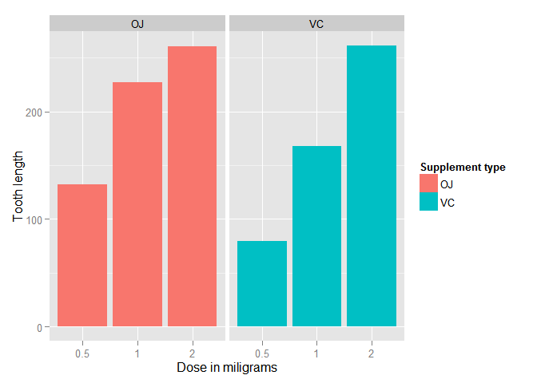
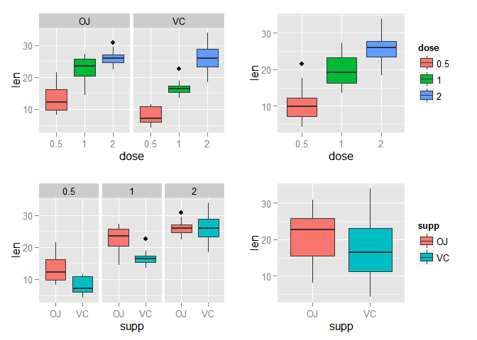

# Statisitcal Inference Part 2  - Tooth Growth
Sunday, July 26, 2015  

## Overview
In the second part of the project, we analyze the `ToothGrowth` data in the R
datasets package

- We will load the ToothGrowth data and perform some basic exploratory data analyses 
- We provide a basic summary of the data.
- Use confidence intervals and/or hypothesis tests to compare tooth growth by supp and dose. (Only use the techniques from class, even if there's other approaches worth considering)
- State our conclusions and the assumptions needed for our conclusions. 

The data is set of 60 observations, length of odontoblasts
(teeth) in each of 10 guinea pigs at each of three dose levels of Vitamin C
(0.5, 1 and 2 mg) with each of two delivery methods (orange juice or ascorbic
acid).
The data is set of 60 observations, length of odontoblasts
(teeth) in each of 10 guinea pigs at each of three dose levels of Vitamin C
(0.5, 1 and 2 mg) with each of two delivery methods (orange juice or ascorbic
acid).

## Load the Data and perform some basic exploratory data analysis

```r
# load neccesary libraries
library(ggplot2)
library(datasets)
library(gridExtra)
```

```
## Loading required package: grid
```

```r
library(GGally)

# The Effect of Vitamin C on Tooth Growth in Guinea Pigs
data(ToothGrowth)
toothGrowth <- ToothGrowth 
toothGrowth$dose <- as.factor(toothGrowth$dose) # convert to factor
```


Initial Exploratory Data Analysis

```r
library(datasets)
library(ggplot2)
ggplot(data=ToothGrowth, aes(x=as.factor(dose), y=len, fill=supp)) +
    geom_bar(stat="Identity",) +
    facet_grid(. ~ supp) +
    xlab("Dose in miligrams") +
    ylab("Tooth length") +
    guides(fill=guide_legend(title="Supplement type"))
```

 

As can be seen above, there is a clear positive correlation between the
tooth length and the dose levels of Vitamin C, for both delivery methods.

## Basic Summary of the data

```r
str(toothGrowth)
```

```
## 'data.frame':	60 obs. of  3 variables:
##  $ len : num  4.2 11.5 7.3 5.8 6.4 10 11.2 11.2 5.2 7 ...
##  $ supp: Factor w/ 2 levels "OJ","VC": 2 2 2 2 2 2 2 2 2 2 ...
##  $ dose: Factor w/ 3 levels "0.5","1","2": 1 1 1 1 1 1 1 1 1 1 ...
```

```r
summary(toothGrowth)
```

```
##       len        supp     dose   
##  Min.   : 4.20   OJ:30   0.5:20  
##  1st Qu.:13.07   VC:30   1  :20  
##  Median :19.25           2  :20  
##  Mean   :18.81                   
##  3rd Qu.:25.27                   
##  Max.   :33.90
```

```r
head(toothGrowth)
```

```
##    len supp dose
## 1  4.2   VC  0.5
## 2 11.5   VC  0.5
## 3  7.3   VC  0.5
## 4  5.8   VC  0.5
## 5  6.4   VC  0.5
## 6 10.0   VC  0.5
```

```r
table(toothGrowth$supp, toothGrowth$dose)
```

```
##     
##      0.5  1  2
##   OJ  10 10 10
##   VC  10 10 10
```
 


##Confidence Levels and Hypothsis Testing
The effect of the dose can also be identified using regression analysis. One
interesting question that can also be addressed is whether the supplement type
(i.e. orange juice or ascorbic acid) has any effect on the tooth length. In other
words, how much of the variance in tooth length, if any, can be explained by
the supplement type?


```r
fit <- lm(len ~ dose + supp, data=ToothGrowth)
summary(fit)
```

```
## 
## Call:
## lm(formula = len ~ dose + supp, data = ToothGrowth)
## 
## Residuals:
##    Min     1Q Median     3Q    Max 
## -6.600 -3.700  0.373  2.116  8.800 
## 
## Coefficients:
##             Estimate Std. Error t value Pr(>|t|)    
## (Intercept)   9.2725     1.2824   7.231 1.31e-09 ***
## dose          9.7636     0.8768  11.135 6.31e-16 ***
## suppVC       -3.7000     1.0936  -3.383   0.0013 ** 
## ---
## Signif. codes:  0 '***' 0.001 '**' 0.01 '*' 0.05 '.' 0.1 ' ' 1
## 
## Residual standard error: 4.236 on 57 degrees of freedom
## Multiple R-squared:  0.7038,	Adjusted R-squared:  0.6934 
## F-statistic: 67.72 on 2 and 57 DF,  p-value: 8.716e-16
```

The model explains 70% of the variance in the data.
The intercept is 9.2725, meaning that with no supplement of
Vitamin C, the average tooth length is 9.2725 units. The
coefficient of `dose` is 9.7635714. It can be interpreted as
increasing the delievered dose 1 mg, all else equal (i.e. no change in the
supplement type), would increase the tooth length 9.7635714 units.
The last coefficient is for the supplement type. Since the supplement type is
a categorical variable, dummy variables are used. The computed coefficient
is for `suppVC` and the value is -3.7 meaning that delivering
a given dose as ascorbic acid, without changing the dose, would result in
3.7 units of decrease in the tooth length. Since there
are only two categories, we can also conclude that on average, delivering the dosage as
orange juice would increase the tooth length by 3.7 units.

95% confidence intervals for two variables and the intercept are as follows.

```r
confint(fit)
```

```
##                 2.5 %    97.5 %
## (Intercept)  6.704608 11.840392
## dose         8.007741 11.519402
## suppVC      -5.889905 -1.510095
```
The confidence intervals mean that if we collect a different set of data and
estimate parameters of the linear model many times, 95% of the time, the
coefficient estimations will be in these ranges. For each coefficient (i.e.
intercept, `dose` and `suppVC`), the null hypothesis is that the coefficients are
zero, meaning that no tooth length variation is explained by that variable.
All _p_-values are less than 0.05, rejecting the null hypothesis and suggesting
that each variable explains a significant portion of variability in tooth length,
assuming the significance level is 5%.

T-Test

```r
# Split the data based on dosage
d0.5 <- subset (ToothGrowth, dose == 0.5)
d1.0 <- subset (ToothGrowth, dose == 1.0)
d2.0 <- subset (ToothGrowth, dose == 2.0)
```


```r
# T-test between supplements
test0.5 <- t.test (len ~ supp, paired = FALSE, var.equal = FALSE, data = d0.5)
test0.5$p.value
```

```
## [1] 0.006358607
```


```r
test1.0 <- t.test (len ~ supp, paired = FALSE, var.equal = FALSE, data = d1.0)
test1.0$p.value
```

```
## [1] 0.001038376
```


```r
test2.0 <- t.test (len ~ supp, paired = FALSE, var.equal = FALSE, data = d2.0)
test2.0$p.value
```

```
## [1] 0.9638516
```

The results of the T-test shows that dosage of 0.5mg and 1mg have relatively low p-value (0.006358 and 0.001038) as compared to the 2.0mg dosage which have a p-value of 0.963851.

For p-values that are more than 0.05, we can conclude that there is little differences in the effect on the length of tooth for the same Vitamin C dosage for the 2 different delivery methods. This is also evident in the plot for the 2mg dosage.

For p-values that are less than 0.05, there is a noticeable difference in the effect on the length of tooth for the same Vitamin C dosage for the 2 different delivery methods. In this particular study, the effect of the 2 different delivery is more visible for the 1.0mg dosage (smallest p-value).


## Conclusions and Assumptions

There are clear indications that both the supplement as the dosage have clear indipendent effects on the length of teeth guinea pigs. More those means on avarage longer teeth. Supplement type has a clear influence too, but Orange Juice has a greater avarage teethgrowth in combination with dosages 0.5 and 1 then for the Vitamin C supplement, while teeth length for the Vitamin C supplement vs the Orage Juice in combiantion with dosage 2 has no significant effect (almost same mean & same confidence interval)

The following assumptions have been made included in the conclusion:

* that the guinea pigs are repesentative i.e same size etc for the population of guinea pigs, 
* that dosage and supplement were randomly assigned and 
* that the distribution of the means is normal.
